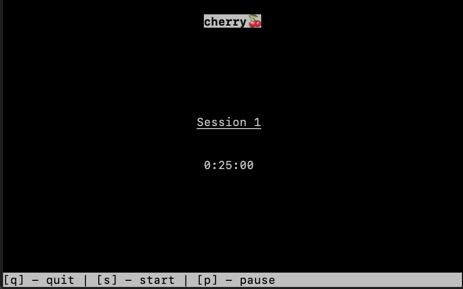

# Cherry 🍒
Cherry is currently macOS only minimalistic command line pomodoro timer, utilising the curses module.
<br>
<br>
It aims to have as few distractions as possible, allowing you to get on with your work.
<br>
<br>
Your work time will be broken up into sessions of 25 minutes, with a 5 minute break in between these. <br>
On your fourth break, the break time will be extended to 30 minutes, in keeping with the traditional pomodoro technique 🍅.
<br>
<br>
In future, Cherry may have variations on the traditional pomodoro technique, such as flow modes. The command list and this README will be updated accordingly.
<br>

---





---

## Commands
Starting / Restarting the central timer:
`s`

<br>


Pausing the central timer:
`p`

<br>


Exiting Cherry:
`q`

<br>


>Note: Cherry is CAPS-sensitive, so please use lowercase characters to operate the program

---

## Dependencies
None, except for having macOS. <br>
macOS comes with curses installed, and while windows computers can download an external module to get access to curses, the sound alert feature would break. <br>

Windows support may come in future updates. <br>

---

## Running Cherry
In order to run Cherry, do the following, its easy :)
<br>
```
git clone [url]
```

> If you do not have git, manually download this repository

<br>

```
cd cherry/src
```

<br>

```
python3 main.py
```
---

Alternatively, you can just run the `cherry.exe`, which has been bundled using pyinstaller.

<br>
That's it. Enjoy 🍒
